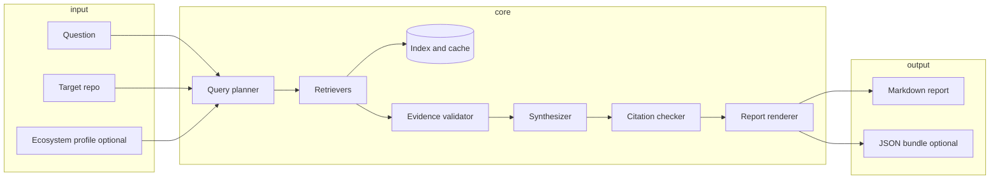

# Casefile — system architecture

**Implementation:** standalone Python package.

This document describes a **universal** evidence-retrieval pipeline. [`torch.masked`](https://github.com/pytorch/pytorch/tree/main/torch/masked) is the reference scenario throughout; the same engine must run for any `--repo owner/name` with optional `--ecosystem` enrichment.

---

## Goals and non-goals

**Goals**

- Given a natural-language question and a target repository, produce a **structured, cited evidence report** a human can verify in minutes.
- Keep retrieval, validation, and synthesis as separate stages so each can be tested without an LLM.
- Specialise via **ecosystem profiles** (YAML), not hard-coded PyTorch logic in core code.

**Non-goals**

- Verdict-first Q&A ("yes, contribute").
- Auto-labeling, auto-closing issues, or submitting PRs.
- Full-repo mirroring or code understanding beyond path-scoped git metadata.
- Replacing maintainer judgment.

---

## High-level pipeline



**Invariant:** nothing enters the report `Evidence` section unless it passed validation (real URL, fetch succeeded, within freshness window). The synthesizer may only reference evidence IDs present in the bundle.

---

## Package layout

Planned Python 3.11 package. One library; CLI and GitHub App are thin adapters.

```text
casefile/
  pyproject.toml
  casefile/
    __init__.py
    cli.py                 # typer: assess, ping, index refresh
    config.py              # env, paths, rate-limit budgets

    models/
      assessment.py        # AssessmentRequest, AssessmentReport
      evidence.py          # EvidenceItem, EvidenceBundle, EvidenceKind
      profile.py           # EcosystemProfile (pydantic)

    engine/
      planner.py           # Question → RetrievalPlan
      orchestrator.py      # runs retrievers, merges, dedupes
      validator.py         # URL alive, freshness, no orphan claims
      synthesizer.py       # LLM call with evidence-only context
      citation_checker.py  # post-pass: every [n] resolves

    retrievers/
      base.py              # Retriever protocol
      github_issues.py
      github_prs.py        # Tier 2
      git_activity.py      # path-scoped log (local clone or API)
      repo_files.py        # README, CONTRIBUTING, CODEOWNERS
      discourse.py         # generic HTTP fetch + extract (profile-driven)
      adjacent.py          # candidate generation + existence check

    clients/
      github.py            # httpx, ETag cache, rate-limit tracker
      llm.py               # provider protocol; anthropic, openai
      http.py              # HEAD/GET for validation

    index/
      store.py             # SQLite: metadata, fetch timestamps
      fts.py               # FTS5 on issue/PR titles and bodies
      vectors.py           # lancedb embeddings (optional hybrid rank)

    profiles/
      loader.py            # load YAML, check last_verified
      schema.yaml          # JSON Schema for profile files
      pytorch.yaml         # first shipped profile
      _template.yaml       # copy for new ecosystems

    render/
      markdown.py          # fixed report schema
      github_comment.py    # collapsible sections for App

  tests/
    fixtures/              # recorded HTTP (vcr/pytest-httpx)
    golden/                # torch.masked expected evidence IDs
```

---

## Core data model

All stages exchange pydantic models. Serialization to JSON enables golden tests and GitHub App replay.

### AssessmentRequest

| Field | Type | Required | Example (`torch.masked`) |
|-------|------|----------|--------------------------|
| `question` | str | yes | "Is reviving MaskedTensor worth an upstream contribution?" |
| `repo` | str | yes | `pytorch/pytorch` |
| `path` | str | no | `torch/masked` |
| `ecosystem` | str | no | `pytorch` |
| `tier` | int | no (default 1) | `2` enables PR/discourse retrievers |
| `max_evidence` | int | no (default 40) | cap before synthesis |

### EvidenceItem

| Field | Type | Notes |
|-------|------|-------|
| `id` | str | stable slug, e.g. `issue-89734` |
| `kind` | EvidenceKind | enum below |
| `title` | str | human label |
| `url` | HttpUrl | canonical link |
| `snippet` | str | ≤500 chars for synthesis context |
| `retrieved_at` | datetime | UTC |
| `source_retriever` | str | provenance for debugging |
| `relevance_score` | float | 0–1 from ranker |
| `metadata` | dict | kind-specific (state, labels, merged_at, …) |

**EvidenceKind** (extensible enum):

`issue`, `issue_comment`, `pull_request`, `commit`, `file`, `discourse_thread`, `release`, `adjacent_project`, `process_doc`

### EvidenceBundle

- `items: list[EvidenceItem]` — deduped by URL
- `open_questions: list[str]` — retriever failures, rate limits, ambiguous gaps
- `freshness: datetime` — oldest `retrieved_at` or profile `last_verified`, whichever is worse
- `retrieval_stats: dict` — API calls, cache hits, duration

### AssessmentReport

- `request: AssessmentRequest`
- `evidence: EvidenceBundle`
- `summary: str | None` — synthesis paragraphs with `[n]` tags; `None` if `--no-synthesis`
- `citation_map: dict[int, str]` — `[n]` → evidence id
- `validation_errors: list[str]` — citation checker output; empty = pass

---

## Retriever protocol

Every retriever is a stateless class implementing one interface. The orchestrator runs them concurrently (asyncio + httpx) subject to a global rate-limit budget.

```python
class Retriever(Protocol):
    name: str
    tier: int  # 1 = MVP, 2 = Phase 1.5, 3 = optional

    def plan(self, request: AssessmentRequest, profile: EcosystemProfile | None) -> RetrievalSpec: ...

    async def fetch(
        self,
        spec: RetrievalSpec,
        clients: ClientBundle,
        index: IndexStore,
    ) -> list[EvidenceItem]: ...
```

**RetrievalSpec** carries planned queries (GitHub search strings, paths, discourse URLs) so `plan()` is unit-testable without network.

### Built-in retrievers (universal)

| Retriever | Tier | Input | Output kind |
|-----------|------|-------|-------------|
| `GitHubIssuesRetriever` | 1 | repo + query embedding/keywords | `issue`, `issue_comment` |
| `RepoFilesRetriever` | 1 | repo + paths from profile or defaults | `file`, `process_doc` |
| `GitActivityRetriever` | 1 | repo + `--path` | `commit` |
| `AdjacentProjectsRetriever` | 1 | question + profile.adjacent | `adjacent_project` (validated only) |
| `GitHubPRsRetriever` | 2 | repo + path + linked issues | `pull_request` |
| `DiscourseRetriever` | 2 | profile.discourse URLs + query | `discourse_thread` |
| `ReleasesRetriever` | 2 | repo tags/releases | `release` |

Profile adds **sources and synonyms**; retriever code stays generic.

### Ranking (hybrid)

1. **FTS5** keyword match on indexed issue/PR text (profile synonym expansion).
2. **Vector** similarity (embedding of question vs item title+snippet).
3. **Recency** boost for commits and merged PRs.
4. **Profile weights** — e.g. label `module: masked` +0.2 for PyTorch.

Final score = weighted sum; top-K per kind before global cap.

---

## Query planner

`planner.py` turns `(question, repo, profile)` into a `RetrievalPlan`:

1. Expand question with profile **synonyms** (`masked tensor` → `MaskedTensor`, `NestedTensor`, …).
2. Select retrievers by `tier` and available profile sections.
3. Build GitHub search queries (issues: `repo:pytorch/pytorch masked tensor`, PRs: `repo:pytorch/pytorch path:torch/masked`).
4. Attach default file paths: `README.md`, `CONTRIBUTING.md`, `.github/CODEOWNERS`, plus profile `scope_files`.
5. Set rate-limit budget (default: 25 search calls, 100 REST calls per assessment).

No LLM in the planner for MVP — keeps runs deterministic and cheap. Optional later: LLM suggests extra keywords, planner still validates.

---

## Evidence validator

Runs **before** synthesis on every `EvidenceItem`:

| Check | Action on failure |
|-------|-------------------|
| URL returns 2xx or valid GitHub API object | drop item; log to `open_questions` |
| `retrieved_at` within profile `max_age_days` | drop if index stale; suggest `casefile index refresh` |
| Adjacent project: repo or docs URL exists | drop; never pass to synthesizer |
| Duplicate URL | merge, keep higher score |

AdjacentProjectsRetriever flow:

1. Static list from profile `adjacent_projects` (always validated).
2. Optional LLM proposes extra names → **must** pass HTTP/GitHub existence check → drop failures silently.

---

## Synthesizer and citation checker

**Synthesizer**

- Input: question + evidence items (id, title, snippet, url only — not full bodies).
- System prompt: evidence-only; refuse unknown projects; tag sentences with `[n]`.
- Output: structured JSON `{ paragraphs: [...], citations: { "1": "issue-89734", ... } }` preferred over free text.

**Citation checker**

- Every `[n]` in summary maps to an evidence id.
- Every evidence id referenced must exist in bundle.
- Optional: LLM sentence ↔ snippet entailment check (Phase 3 eval harness).

If checker fails: strip summary, keep evidence, set `validation_errors`, still write report.

---

## Index and cache

Single-machine SQLite under `~/.cache/casefile/` (override via env).

| Table | Purpose |
|-------|---------|
| `evidence_raw` | serialized item bodies, etag |
| `evidence_fts` | FTS5 virtual table |
| `fetch_log` | url, fetched_at, status |
| `embeddings` | optional lancedb path or blob ref |

**Index refresh** (`casefile index refresh --repo pytorch/pytorch`):

- Incremental GitHub issue/PR sync since last cursor.
- Respects rate limits; resumes on interrupt.

Assessments prefer index when fresh; fall back to live API with shorter timeout.

---

## Ecosystem profile

Profiles are YAML on disk. Core code loads by name; no PyTorch imports in engine.

See [`profiles/_template.yaml`](profiles/_template.yaml) and [`profiles/pytorch.yaml`](profiles/pytorch.yaml).

Profile responsibilities:

- Extra retrieval sources (discourse base URL, RFC doc patterns).
- Synonym map for query expansion.
- Adjacent projects list (pre-validated URLs maintained by curator).
- Label hints for ranking boosts.
- Freshness metadata (`last_verified`).

Adding JAX = new YAML file, zero engine changes.

---

## Delivery adapters

### CLI (`casefile assess`)

```bash
casefile assess \
  --question "Should we invest in reviving MaskedTensor?" \
  --repo pytorch/pytorch \
  --path torch/masked \
  --ecosystem pytorch \
  --tier 2 \
  --output report.md
```

Flags: `--no-synthesis`, `--json`, `--refresh-index`.

### GitHub App (Phase 2)

- Webhook → build `AssessmentRequest` from issue title + body.
- Call same `orchestrator.run()`.
- `render.github_comment` → sticky comment; store report hash on issue label for idempotent re-run.

---

## Reference walkthrough: `torch.masked`

**Request**

```yaml
question: "Is reviving torch.masked / MaskedTensor worth a multi-month upstream contribution?"
repo: pytorch/pytorch
path: torch/masked
ecosystem: pytorch
tier: 2
```

**Planner output (abbreviated)**

| Retriever | Planned work |
|-----------|--------------|
| GitHubIssues | search: `repo:pytorch/pytorch masked MaskedTensor`; boost labels from profile |
| GitHubPRs | merged PRs `path:torch/masked` last 24 months |
| GitActivity | log stat on `torch/masked/` |
| RepoFiles | `CONTRIBUTING.md`, `.github/CODEOWNERS`, `docs/source/masked.md` |
| Discourse | search dev-discuss for "masked tensor" |
| Adjacent | validate NestedTensor, FlexAttention, `torch.nested` docs from profile |

**Expected evidence IDs (golden test)**

Must appear in top results for regression:

- `issue-89734`, `issue-89320`, `issue-124964` (exact numbers may shift; golden file uses pattern + manual review)
- At least one `adjacent_project` for NestedTensor or FlexAttention with live doc URL
- `commit` or activity block showing last touch on `torch/masked`
- Tier 2: optional `discourse_thread` or `pull_request` if linked

**Open questions the report should honestly list**

- Prototype label removal timeline (if not in sources).
- Whether core team prefers NestedTensor for all masked-sequence use cases.
- Maintainer bandwidth (inference, not fact — synthesis must say "open question").

---

## Configuration and secrets

| Env var | Purpose |
|---------|---------|
| `CASEFILE_GITHUB_TOKEN` | fine-grained PAT, read-only |
| `CASEFILE_ANTHROPIC_API_KEY` | primary LLM |
| `CASEFILE_OPENAI_API_KEY` | fallback / embeddings |
| `CASEFILE_CACHE_DIR` | override index path |
| `CASEFILE_LLM_PROVIDER` | `anthropic` \| `openai` |

Never commit tokens. `casefile ping` verifies GitHub + LLM connectivity.

---

## Testing strategy

| Layer | Approach |
|-------|----------|
| Retrievers | pytest-httpx fixtures from recorded GitHub responses |
| Validator | synthetic dead URLs, stale timestamps |
| Planner | snapshot tests on torch.masked plan |
| Golden | full assess run against fixtures → compare evidence ids |
| Citation checker | mutate summary with bad `[n]` → expect errors |
| Live smoke | optional nightly, rate-limited, not in CI |

---

## Phased implementation map

| Architecture piece | backlog phase |
|--------------------|-------------------|
| models, clients, `ping` | 0.5 |
| Tier 1 retrievers, validator, markdown render | 1 |
| GitHubPRs, Discourse, pytorch profile | 1.5 |
| synthesizer + citation checker | 1 |
| GitHub App adapter | 2 |
| second profile, eval harness | 3 |

---

## Open design decisions

- [ ] Async (`asyncio`) vs sync retrievers with thread pool — default async for parallel I/O.
- [ ] Embed at index time vs query time — index time for issues; query time for question embedding only.
- [ ] Local git clone vs GitHub commits API for activity — prefer API for MVP; optional clone for offline.
- [ ] JSON report as primary artifact with markdown as render target — lean toward yes for App idempotency.

